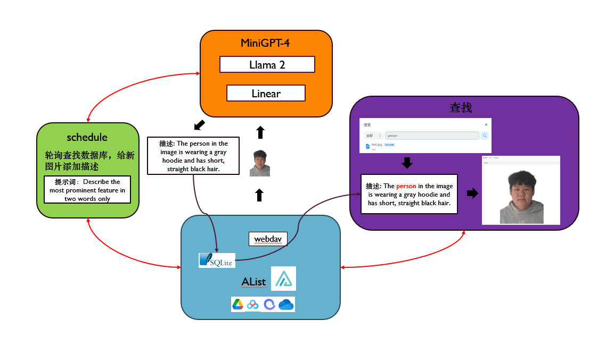

# Alist&MiniGPT 图像智能搜索与描述系统 

MiniGPT-4: 使用先进的大型语言模型增强视觉语言理解 作者为朱德尧、陈俊、沈晓倩、李翔和Mohamed Elhoseiny。*表示贡献相等。<br>
Alist:一个支持多存储的文件列表程序，使用 Gin 和 Solidjs。

## 介绍
Alist 作为一个云盘整合工具，为用户提供了便捷的云端文件管理体验。为了进一步提升用户使用体验，本项目通过集成 GPT 技术，实现了对云盘中图片的智能搜索和描述生成。用户可以通过图像关键词搜索以及由 GPT 生成的图像描述，更高效地定位和管理云盘中的图片资源。

功能：
实现基于关键词的图像搜索功能。
利用 GPT 技术生成准确、富有描述性的图片描述。
通过图像描述，为用户提供更直观、便捷的文件搜索和管理方式。

特点：
Alist 云盘整合： 利用 Alist 提供的云盘整合功能，将用户的云端图片资源汇聚在一个统一的工具中，方便集中管理。
GPT 图像描述技术： 结合 GPT 技术，对云盘中的图片进行智能描述生成，为每张图片生成富有描述性的文本。
关键词搜索： 提供基于关键词的图像搜索功能，使用户能够通过关键词快速定位所需图片。




## 安装
### Alist的下载安装
**1.环境准备**<br>
首先，你需要一个有```git```，```nodejs```，```pnpm```，```golang>=1.20```，```gcc```的环境<br>

**2.构建前端**<br>
```bash 
git clone https://github.com/slowmagic10/alist-minigpt.git
cd alist-minigpt/alist-web
```
执行 ```pnpm install``` && ```pnpm build``` 得到 dist 目录下的目标文件

**3.构建后端**<br>
```bash
cd ..
cd alist
```
将上一步的 ```dist``` 目录复制到项目下的 ```public``` 目录下，然后执行
```bash
bash run.sh
```


## Alist源码及文档
<https://github.com/alist-org/alist/tree/main><br>
<https://alist.nn.ci/zh/>

## MiniGPT源码
<https://github.com/Vision-CAIR/MiniGPT-4>

