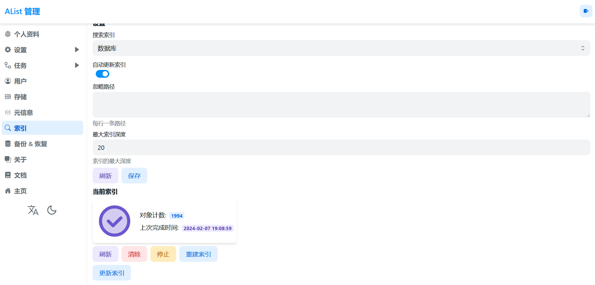

# Alist&MiniGPT 
一个云盘管理及图像智能搜索综合系统 
## 介绍
Alist 作为一个云盘整合工具，为用户提供了便捷的云端文件管理体验。为了进一步提升用户使用体验，本项目通过集成 GPT 技术，实现了对云盘中图片的智能搜索和描述生成。用户可以通过图像关键词搜索以及由 GPT 生成的图像描述，更高效地定位和管理云盘中的图片资源。

功能：
实现基于关键词的图像搜索功能。
利用 GPT 技术生成准确、富有描述性的图片描述。
通过图像描述，为用户提供更直观、便捷的文件搜索和管理方式。

特点：
Alist 云盘整合： 利用 Alist 提供的云盘整合功能，将用户的云端图片资源汇聚在一个统一的工具中，方便集中管理。
GPT 图像描述技术： 结合 GPT 技术，对云盘中的图片进行智能描述生成，为每张图片生成富有描述性的文本。
关键词搜索： 提供基于关键词的图像搜索功能，使用户能够通过关键词快速定位所需图片。


## 下载及配置
### Alist的下载及配置
#### Alist源码及文档
<https://github.com/alist-org/alist/tree/main><br>
<https://alist.nn.ci/zh/><br>

**1.环境准备**<br>
首先，你需要一个有```git```，```nodejs```，```pnpm```，```golang>=1.20```，```gcc```的环境<br>

**2.构建前端**<br>
```bash 
git clone https://github.com/slowmagic10/alist-minigpt.git
cd alist-minigpt/alist-web
```
执行 ```pnpm install``` && ```pnpm build``` 得到 dist 目录下的目标文件

**3.构建后端**<br>
```bash
cd ..
cd alist
```
将上一步的 ```dist``` 目录复制到项目下的 ```public``` 目录下，然后执行
```bash
bash run.sh
```

**4.运行服务**<br>
* 在Linux或Mac上运行
```bash
./alist server
```

* 在Windows上运行
```bash
./alist.exe server
```


**5.构建索引**<br>
登录后安装官方教程：```https://alist.nn.ci/zh/guide/drivers/common.html```挂载网盘<br>
进入管理界面，选择索引为云盘文件添加索引



### MiniGPT-4的下载及配置
#### MiniGPT源码
<https://github.com/Vision-CAIR/MiniGPT-4>

**1.代码及环境准备**
创建一个Python环境，然后通过以下命令激活它
```bash
cd MiniGPT-4
conda env create -f environment.yml
conda activate minigptv
```


**2.准备预训练的大模型权重**

**MiniGPT-v2** 是基于Llama2 Chat 7B模型的。 
通过使用 git-lfs 克隆存储库，从以下 Huggingface 空间下载相应的 LLM 权重。

|                            Llama 2 Chat 7B                             |                                           Vicuna V0 13B                                           |                                          Vicuna V0 7B                                          |
:------------------------------------------------------------------------------------------------:|:----------------------------------------------------------------------------------------------:|:----------------------------------------------------------------------------------------------:
[Download](https://huggingface.co/meta-llama/Llama-2-7b-chat-hf/tree/main) | [Downlad](https://huggingface.co/Vision-CAIR/vicuna/tree/main) | [Download](https://huggingface.co/Vision-CAIR/vicuna-7b/tree/main) 

然后，将模型配置文件中的变量*llama_model*设置为LLM权重路径。
[这里](./MiniGPT-4/minigpt4/configs/models/minigpt_v2.yaml)在第14行。


**3. 准备预训练的模型检查点**

下载预训练的模型检查点

| MiniGPT-v2 (after stage-2) | MiniGPT-v2 (after stage-3) | MiniGPT-v2 (online developing demo)| 
|------------------------------|------------------------------|------------------------------|
| [Download](https://drive.google.com/file/d/1Vi_E7ZtZXRAQcyz4f8E6LtLh2UXABCmu/view?usp=sharing) |[Download](https://drive.google.com/file/d/1HkoUUrjzFGn33cSiUkI-KcT-zysCynAz/view?usp=sharing) | [Download](https://drive.google.com/file/d/1aVbfW7nkCSYx99_vCRyP1sOlQiWVSnAl/view?usp=sharing) |


在进化配置文件中设置预训练检查点的路径 
[eval_configs/minigptv2_eval.yaml](./MiniGPT-4/eval_configs/minigptv2_eval.yaml)第8行。


| MiniGPT-4 (Vicuna 13B) | MiniGPT-4 (Vicuna 7B) | MiniGPT-4 (LLaMA-2 Chat 7B) |
|----------------------------|---------------------------|---------------------------------|
| [Download](https://drive.google.com/file/d/1a4zLvaiDBr-36pasffmgpvH5P7CKmpze/view?usp=share_link) | [Download](https://drive.google.com/file/d/1RY9jV0dyqLX-o38LrumkKRh6Jtaop58R/view?usp=sharing) | [Download](https://drive.google.com/file/d/11nAPjEok8eAGGEG1N2vXo3kBLCg0WgUk/view?usp=sharing) |

**4.设置MiniGPT访问的图片地址**<br>
Alist支持通过webdav访问文件,下载支持访问webdav的库
```bash
pip install webdavclient3
```
在[这里](./MiniGPT-4/alist.py#90)第89行中设置自己的访问地址


## 感谢
MiniGPT-4: 使用先进的大型语言模型增强视觉语言理解 作者为朱德尧、陈俊、沈晓倩、李翔和Mohamed Elhoseiny。*表示贡献相等。<br>
Alist:一个支持多存储的文件列表程序，使用 Gin 和 Solidjs。


